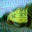

## Defective Convolutional Networks
Created by <a href="https://tiangeluo.github.io/" target="_blank">Tiange Luo*</a>, <a href="https://tianle.website" target="_black">Tianle Cai*</a>, <a href="" target="_blank">Mengxiao Zhang</a>, <a href="" target="_blank">Siyu Chen</a>, <a href="https://scholar.google.com/citations?user=orVoz4IAAAAJ&hl=en" target="_blank">Di He</a> and <a href="https://scholar.google.com/citations?user=VZHxoh8AAAAJ&hl=zh-CN" target="_blank">Liwei Wang</a>

<table width="100%" border="0" cellspacing="0" cellpadding="0">
  <tr>
    <td align="center"> </td>
    <td align="center"></td>
  </tr>
  <tr>
    <td align="center">The origin image labeled as Truck</td>
    <td align="center">The adversarial example(\ell_\infty = 16) predicted by the model as Frog</td>
  </tr>
</table>

## Introduction
This repository is code release for this [paper](https://arxiv.org/abs/1911.08432).

Robustness of convolutional neural networks has recently been highlighted by the
adversarial examples, i.e., inputs added with well-designed perturbations which
are imperceptible to humans but can cause the network to give incorrect outputs.
Recent research suggests that the noises in adversarial examples break the textural
structure, which eventually leads to wrong predictions by convolutional neural
networks. To help a convolutional neural network make predictions relying less
on textural information, we propose defective convolutional layers which contain
defective neurons whose activations are set to be a constant function. As the
defective neurons contain no information and are far different from the standard
neurons in its spatial neighborhood, the textural features cannot be accurately
extracted and the model has to seek for other features for classification, such as
the shape. We first show that predictions made by the defective CNN are less
dependent on textural information, but more on shape information, and further
find that adversarial examples generated by the defective CNN appear to have
semantic shapes. Experimental results demonstrate the defective CNN has higher
defense ability than the standard CNN against various types of attack. In particular,
it achieves state-of-the-art performance against transfer-based attacks without
applying any adversarial training.

## Citation
If you find our work or codes useful in your research, please consider citing:
    @inproceedings{
          anonymous2021defective,
          title={Defective Convolutional Networks},
          author={Anonymous},
          booktitle={Submitted to International Conference on Learning Representations},
          year={2021},
          url={https://openreview.net/forum?id=E8fmaZwzEj},
          note={under review}
    }

## Requirements
- Python: 2.7.14
- PyTorch: 0.4.1
- CUDA: 9.0

## Codes Organization

- Attacks: implementations of attack methods including FGSM, PGD, MIFGSM, CW, and boundray attacks. The codes will generate adversarial examples, and test the white-box defense performance (FGSM, PGD, MIFGSM, CW), and the black-box defense performance against decision-based attack. Also, we have compared our implementations with the implementation from Github.

- Defenses: codes to evaluate the black-box defense performance against the adversarial examples generated by other models. Using the implementations under **Attacks** folder to generate adversarial examples. Running the codes under **Mains** folder to train the models.

- Mains: codes for training models on CIFAR-10 dataset. codes are named as main_xxx_drop_ttt_pp.py, where xxx means the network archtecture or used methods, ttt means the position to apply defective convolutional layers, and pp means the (1 - keep probability). If xxx is omitted, the code train a model based on ResNet-18.

- Masks: codes for generating masks of defective neurons. codes are named as genmask_xxx_ttt_pp.py, where xxx means the network archtecture, ttt means the position to apply defective convolutional layers, and pp means the (1 - keep probability). If xxx is omitted, the code generates a mask for ResNet-18.

- MNIST: codes for MNIST experiments. See the paper for detailed settings.

- Models: various networks including all standard CNNs and their defective version. codes are named as xxx_drop_ttt_pp.py, where xxx means the network archtecture, ttt means the position to apply defective convolutional layers, and pp means the (1 - keep probability).

- RandomShuffle: codes for the random shuffle experiments. See the paper for detailed settings.

- RandomNoise: codes for the random noise experiments. See the paper for detailed settings.
